# **Conditional DCGAN on CelebA**
This project aims to create a Generative Adverisle Network (GAN) capable of generating high quality, realistic face images based on the CelebA dataset.

**Core ML Skills:**  
 
 
 
 
 
 
  

**Tools / Stack:**  
 
 
 

# **🚀 Results**

### Impact Statement:
This project highlights my ability to take an advanced ML model from **baseline design** all the way to **production-oriented results** through **through experimentation, tuning, evaluation** — end-to-end skills directly relevant for production ML engineering roles.

## 📖 Overview
- Demonstrated ability to **design, train, and evaluate** modern generative models.  
- Developed a **Conditional DCGAN** on CelebA 64×64 with attribute conditioning to **generate realistic faces**.  
- Applied advanced **stabilization and monitoring techniques** to ensure robust and balanced training.  
- Conducted **8 experimental runs**, systematically identifying the optimal architecture, loss functions, and regularization strategies.  

## 🎯 Highlights
- **Model**: Conditional DCGAN (Projection Discriminator + Hinge Loss + EMA-G)  
- **Data**: CelebA 64×64 with *Male* and *Smiling* attribute conditions  
- **Result**: Generates diverse and realistic images; **FID ≈ 4.8 @ 64×64** (10k vs 10k, Inception-V3 pool)  
- **Key training strategies**: Balanced Generator/Discriminator schedules, constant but adjustable learning rates, and selective use of regularization tools to maintain adversarial equilibrium  

## 🧭 Roadmap

* Add extra low or uncorrelated attributes like **"Eye_Glasses"**
* Re‑introduce **mbstd** laywer in D architecture
* Scale to **128×128** via progressive‑resize curriculum

## 🖼️ Visual Results - What can the model do?

### ✨ GAN Image Parade  - Quality 
The curated samples below highlight the generator’s ability to produce sharp, realistic faces that follow the conditioning inputs (*Male*, *Smiling*).

<table>
  <tr>
    <th colspan="4">
      <h3 align="center">High Quality Showcase Examples</h3>
  </tr>
  <tr>
    <td>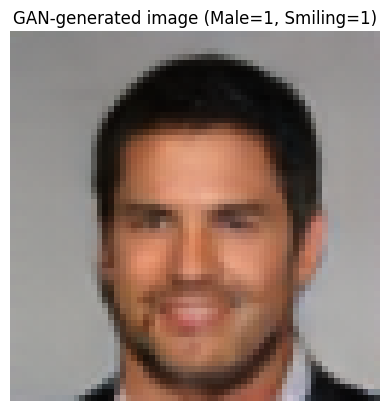</td>
    <td>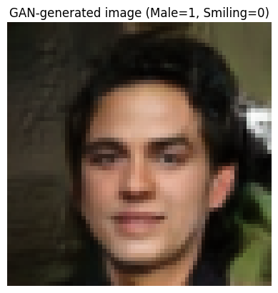</td>
    <td>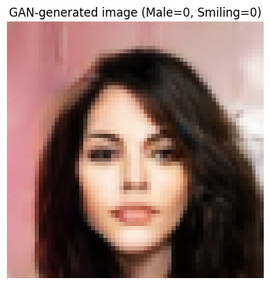</td>
    <td>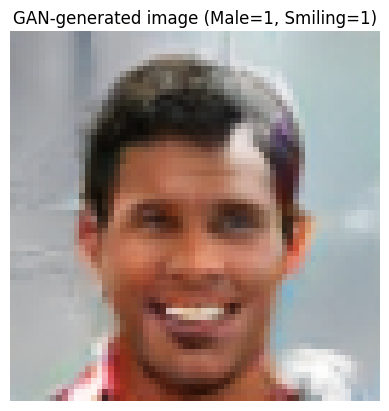</td>
  </tr>
  <tr>
    <td>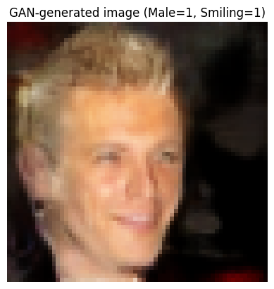</td>
    <td>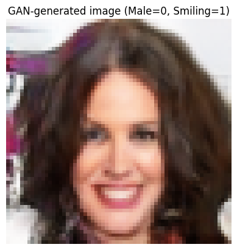</td>
    <td>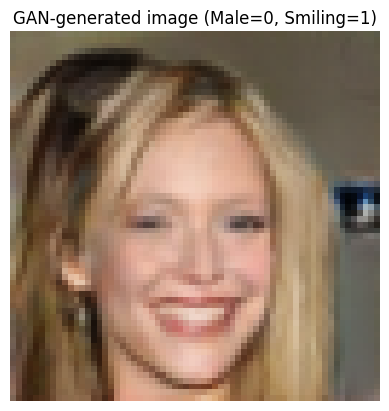</td>
    <td>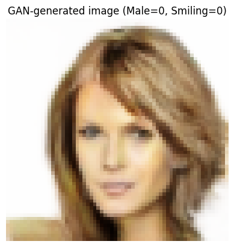</td>
  </tr>
  <tr>
    <td>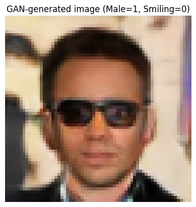</td>
    <td>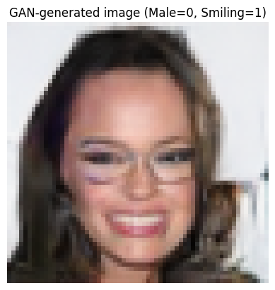</td>
    <td>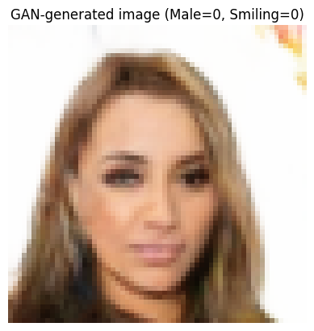</td>
    <td>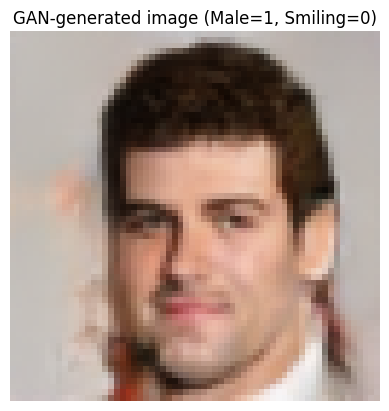</td>
  </tr>
</table>

### 🎲 Random 100-Image Mosaic - Diversity 
The grid below shows **100 uncurated samples**, offering an unbiased view of model performance: 

- Captures a wide range of CelebA features: hairstyles, glasses, facial hair, makeup  
- No evidence of mode collapse — samples remain **diverse and realistic**  
- Minor artifacts (blur/distortion) expected at 64×64 resolution, but overall images are **sharp, realistic, and varied**  

  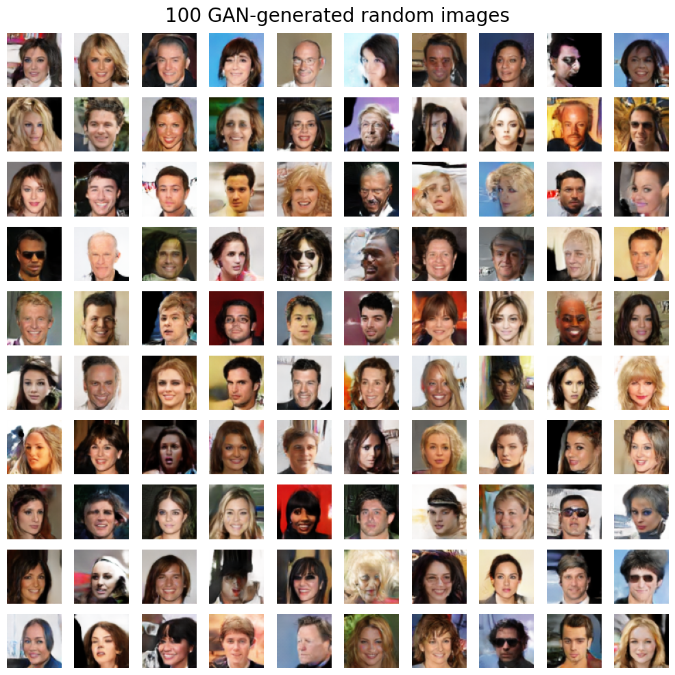

# **⚙️ Tech Deep Dive**

# 📊 1. Evaluation - How good is the model?

The evaluation demonstrates that the model is **both quantitatively strong (FID ≈ 4.8)** and **qualitatively reliable (attribute control is clear and consistent)**. Together, these results confirm that the model is not just producing visually appealing faces but is a **well-tuned conditional GAN** that balances realism, diversity, and controllability.

## 📈 1.1. FID metric
Frechet Inception Distance (FID) measures how closely generated images match real data. It compares **feature statistics** (means and covariances) of real vs. generated images, extracted from a pre-trained **Inception-V3** model (standard in GAN evaluation).  
**Lower FID → more realistic and diverse images.**

### 1.1.1. Evaluation protocol:
- **Dataset:** CelebA, 64×64 resolution 
- **Data split:** 10k validation samples for tuning, 10k held-out for final evaluation 
- **Generator:** EMA generator (smoothed weights for stable outputs)  
- **Generated samples:** 10k generated faces to match real set  
- **Preprocessing:** map outputs from **[-1,1] → [0,1]** 
- **Backbone:** Inception-V3 pool features from `torcheval.metrics.FrechetInceptionDistance`

### 1.1.2. FID progression over training:
- In early epochs, **FID** dropped quickly into the **~10 range**.  
- Improvements slowed after that, with clear **plateaus** where both **visual quality** and **FID** stopped changing. Runs were concluded at these points if further attempts to break the plateau failed.  
- The best of **Experiment 3** reached **FID ≈ 7.8**
- **FID** entered the range **around 5** only after significant **architecture + optimization** changes during **Experiments 5-8**
- **Final model** from **Experiment 8** demonstrated **FID ≈ 4.8**

  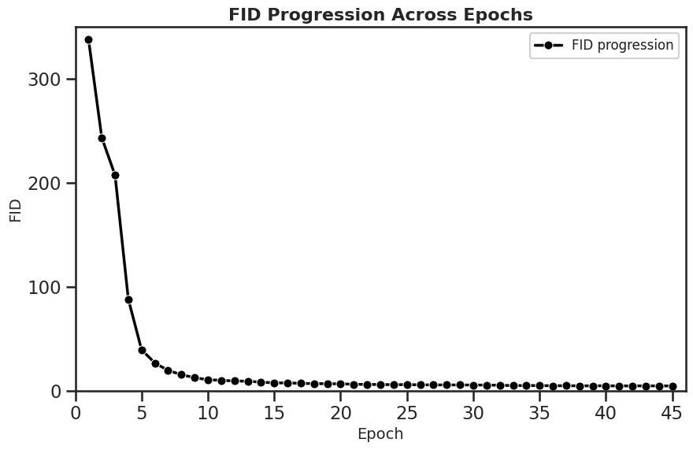
  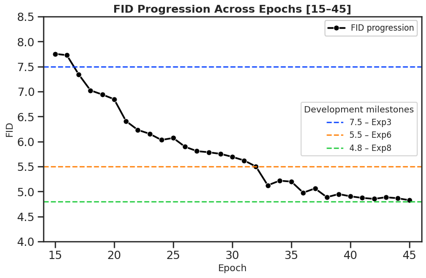

### 1.1.3. Final Result:
The model achieves **testing FID ≈ 4.8**, confirming strong alignment with real data and visible improvements in realism and diversity.

## 1.2. 🎭 Attribute Control
To evaluate **atribute control**, generated images were compared against real samples for all **4 attribute combinations** in the Table below.

- **Male attribute**:  
  - Male=1 → consistent masculine facial structures, minimal leakage.  
  - Male=0 → feminine faces with appropriate styling.  
- **Smiling attribute**:  
  - Smiling=1 → clear smiles, natural teeth.  
  - Smiling=0 → neutral/closed-mouth expressions; occasional distortions, but rare.  

**Fake vs Real Examples**  

| Attribute combo            | Generated (fake)                                         | Real                                             |
|-----------------------------|---------------------------------------------------------|--------------------------------------------------|
| male=1, smiling=1           | 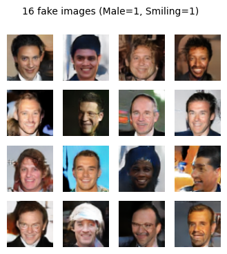 | 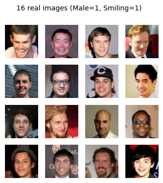 |
| male=1, smiling=0           | 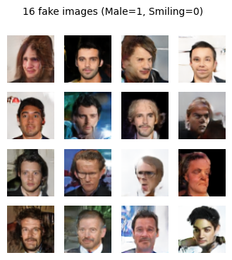 | 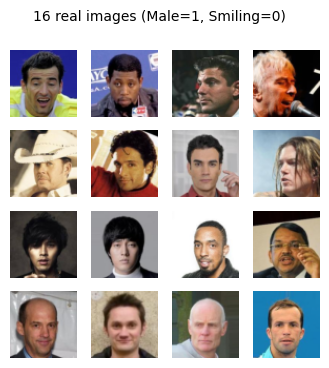 |
| male=0, smiling=1           | 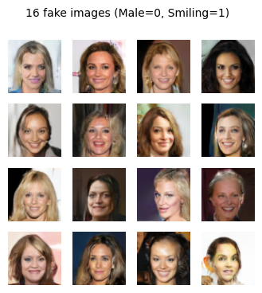 | 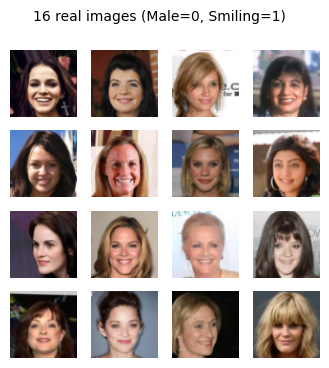 |
| male=0, smiling=0           | 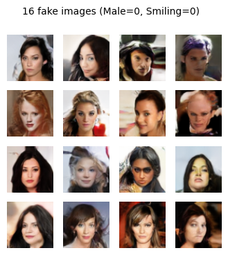 | 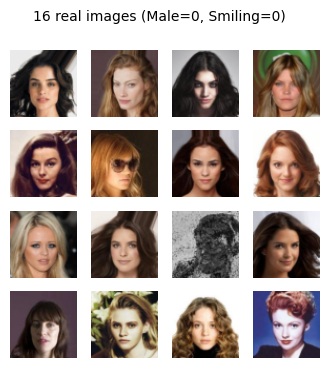 |

> **Summary:** Generated images match real examples relatively closely. Both Male and Smiling attributes demonstrate **clean, reliable control** across all combinations. Remaining mismatches stem mainly from borderline cases (ambiguous hairstyles, subtle expressions) rather than systemic failure.

# 2. 🏗️ Model Design - Why does the model work?

The final model emerged through **iterative modifications** of the classical DCGAN architecture based on experiment outcomes.

## 🖼️ 2.1. Resolution
We trained at **64×64** resolution to balance stability, fidelity, and efficiency:
- 64x64 **preserves key facial features** while avoiding severe distortion compared to 32×32.  
- 64×64 **trains significantly faster** than 128×128, enabling larger batch sizes and faster iteration/debugging.  
 - once stable at 64×64, the same architecture can be **scaled to 128×128** for higher fidelity

>**Why it matters:** enabled fast prototyping while still producing realistic, attribute-controlled faces.  

## 🧬 2.2. Generator
The final generator is a **deep convolutional network with attribute conditioning** (see Figure below).  

- **Input:** G takes two inputs: a 100-dimensional latent vector *z* and a 2- dimensional binary attribute vector *c*. These are concatenated in a single vector.

- **Input fusion:** The vector *[z,c]* goes through a **fully connected layer** and **reshaping**. It fuses the vector input into **seed 736x4x4 feature map** as a starting, learnable canvas.

- **Upsampling pathway:**  a stack of upsampling convolutional blocks **(ConvTranspose → BatchNorm → ReLU)**.  progessively doubles the spatial resolution while reducing channel depth, gradually building facial structure and texture.

- **Output layer:** A final convolution maps to 3 channels, and a **Tanh** activation squashes pixel values into [-1, 1]. The output *G(z,c)* is **3x64x64 images in [-1, +1] interval**.
 

## 2.3. 🔍 Discriminator
The final architecture of the discriminator is a **deep convolutional discriminator with projection conditioning** (see the Figure below). 

- **Image pathway:** D passes an input tensor *x* (3x64x64 image) through a sequence of convolutional downsampling blocks **(Conv2d → LeakyReLU, with Spectral Normalization, no BatchNorm)**. Each block halves spatial resolution and increases channels. A global **sum pooling** produces the final 512-dimensional feature vector *f(x)*.

- **Unconditional score:** An unconditional score *h(f(x))* (how realistic the image looks regardless of attributes) is computed by passing the pooled feature vector *(f(x)* through a **linear layer** that maps it to a single scalar.

- **Attributes pathway:** The attribute vector *c* is mapped with a **linear layer** to a 512-dim embedding *e(c)*, matching the image feature vector.

- **Projection step:** A final real-value score (logit) is computed as *D(x,c) = h(f(x)) + f(x)T * e(c)*

> **Why Projection-D:**  emperically, it  improved stability and lower FID, compared to a classical conditional D that concatenates attributes to the image channels.

  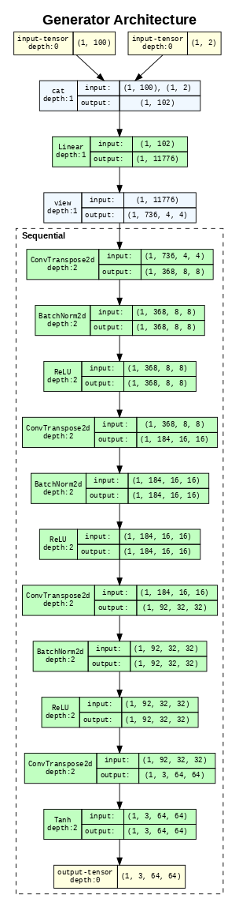
  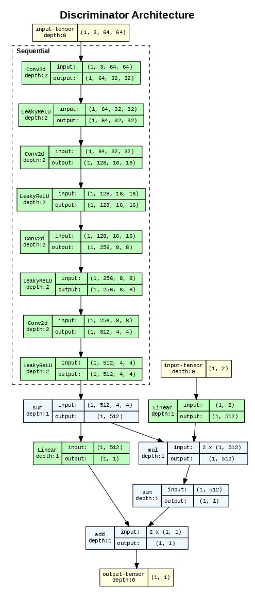

> 👉 **Note:** The number of convolutional features was varied as a hyperparameter to achieve better balance between D's and G's default capabilities 

# ⚖️ 3. Training, Monitoring, Optimization - How to keep the model stable?

Stabilizing adversarial dynamics required a **toolkit of monitoring signals, adaptive regularization, and carefully chosen loss functions**. These methods ensured that the discriminator (D) and generator (G) remained in equilibrium, avoiding collapse while steadily improving image quality.

## 🧪 3.1. Monitoring the Balance Indicators
To track this equilibrium, we monitored:

  - **D real accuracy**: fraction of real images correctly classified. Healthy range: ~0.6–0.8 was kept. 
  - **G fooling rate**: fraction of generated images classified as real. Healthy range: ~0.2–0.3.  

  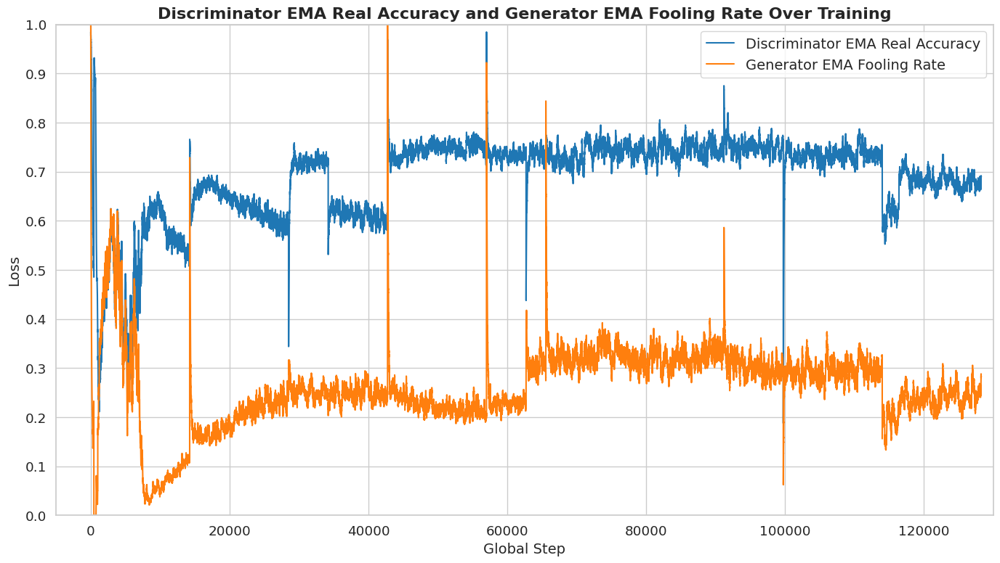

- **E[D(real)] vs E[D(fake)] (ED delta)**: the logit gap between real and fake batches. A stable training run should show a consistent positive gap that narrows slowly as G improves.  

  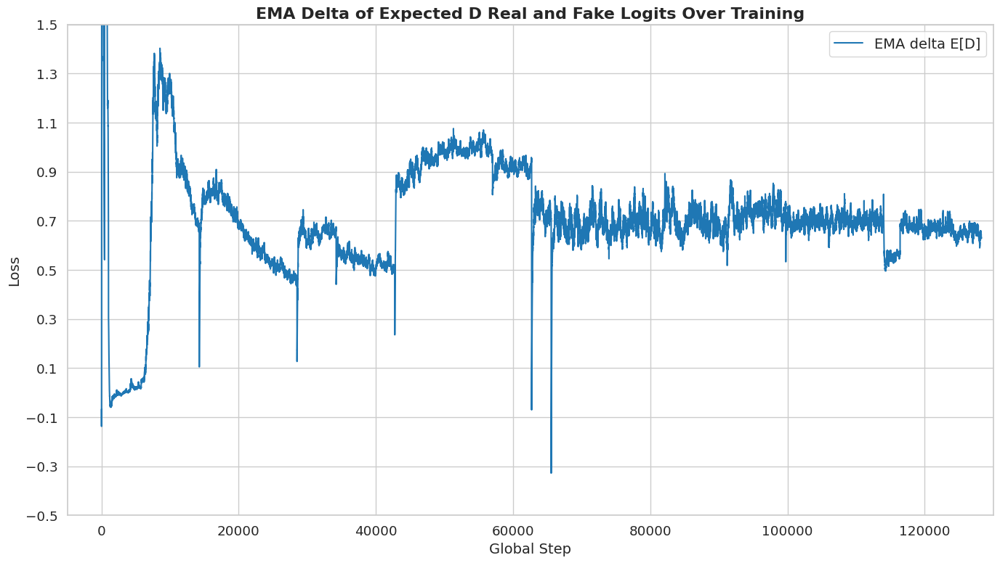

- **Gradient norms**: detect exploding/vanishing updates.  

  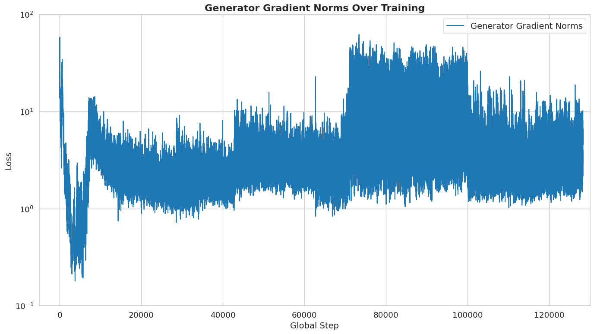

- **Relative weight updates ratio**:  confirms models keep updating and learning.  

  

- **Visual samples from EMA generator**: sanity check for mode collapse and image realism.  

>**Summary.** The figures indicate a stable Discriminator-Generator equilibrium and consistent improvement of G over time.

## 🛠 3.2 Regularization Toolkit
Adaptive tools applied during training:

- **R1 gradient penalty (gamma, k):** applied on real batches; increase when D overfits, relax when underfitting.
- **Spectral Normalization (D):** default on all layers to stabilize gradients.
- **DiffAugment** (color, translation, cutout, noise, flip): light policies always on to prevent D memorization; enable/strengthen policies adaptively when D shows overfitting signals.   
- **Gradient clipping:** prevent overflows in fp16; relaxed when learning slowed 
- **Label smoothing:** real labels set to 0.9 to avoid over-confident discriminator  

## 🔄 3.3. Training-Loop Controls
- **Update ratio (D:G):** baseline 1:1; temporarily 2:1 if G too strong, 1:2 if D too strong  
- **Adjustable learning rates:** dynamic resets favored one side when imbalance appeared  

## ➗ 3.4. Loss function
We adopted **hinge loss** from Experiment 5 onward, replacing binary cross-entropy:

**Formulas**

*Loss_D = E[relu(1-D(x,c))] + E[relu(1+D(G(z,c),c))]*

*Loss_G = -E[D(G(z,c),c))]*

**Why hinge loss?**
- Healthier training dynamics  
- Better balance between D and G  
- Steadier gradients for G  
- More realistic images  
- Robust under mixed precision (fp16)  

### 📉 3.3.1 Loss diagram

The figures below for the **actual losses** and the **EMA-smoothed losses** indicate the **healthy adversarial equilibrium**. While raw D and G losses oscillate within bounded ranges (as expected in GANs), the window gradually narrows. The EMA D and G losses plateaus smoothly, confirming that the **dynamics stabilize**.

  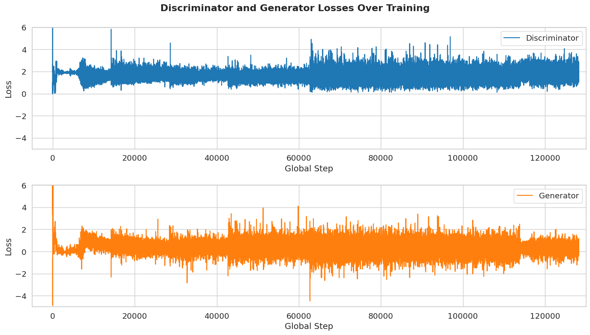

  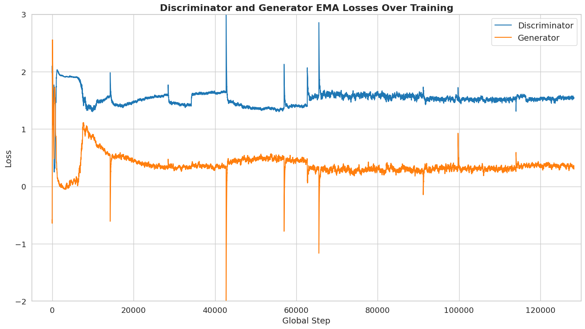

# 📈 4. Experiment Log (8 runs)

This log documents eight experiments, showing both successful strategies and failed attempts that informed the final design

## 🧪 4.1. Experiment 1

* **Setup:** Generic DCGAN architecture; 40 CelebA attributes; BCE loss; cosine learning rate with warm up and decay
* **Resulted images:** Unrealistic, blurred faces; implausible attribute combinations
* **Conclusion:** Too many (and correlated) attributes confounded learning; attribute set was imbalanced and unrealistic

👉 *Key Takeaway:* Simplify conditioning before tuning architecture.

## 🧪 4.2. Experiment 2

* **Setup:** 6 lightly correlated attributes ("No_Beard", "Young", "Attractive", "Male", "Smiling", "Wavy_Hair")
* **Key changes:** Reduced attribute set to narrow conditioning
- **Resulted images:** Checkerboard patterns; many identical-looking images
- **Training dynamics observations:** Early mode collapse
- **Conclusion:** D was too strong; regularization needed to prevent collapse

👉 *Key Takeaway:* Regularization required to keep D in check.

## 🧪 4.3. Experiment 3
- **Setup:** Added R1, Spectral Norm, label smoothing; D to G steps ratio
- **Key changes:** Regularization to stabilize training dynamics 
- **Resulted images:** Crisper, more diverse faces; some samples are flawed; FID ≈ 7.5  
- **Training dynamics observations:** training reached a plateau
- **Conclusion:** Robust for the scope, but headroom limited; needed betters means to monitor training dynamics to improve further

👉 *Key Takeaway:* Monitoring needed; G still too weak.

## 🧪 4.4. Experiment 4
- **Setup:** Added EMA generator, additional training logs/monitoring, and augmenter
- **Key changes:** Use averaged model for inference; expand monitoring and training logs 
- **Resulted images:** No clear visual improvement over Exp 3  
- **Training dynamics observations:** Marginal gains; D continued to overpower G; G fooling rate fluctuates around 0  
- **Conclusion:** EMA improves fidelity slightly, but D architecture remained too catchy; balance was fragile

👉 *Key Takeaway:* Need architectural fix, not just monitoring.

## 🧪 4.5. Experiment 5
- **Setup:** Projection Discriminator; 2 uncorrelated attributes ("Smiling", "Male"); hinge loss; remove BatchNorm from D  
- **Key changes:** Reworked D to projection-style to suit conditional learning and give G more room to keep up with D; simplify the attrbutes space
- **Resulted images:** Slightly blurred but more diverse faces 
- **Training dynamics observations:** Plateau observed; G still comparatively weak; Cosine LR stalled G; G too fragile; grad/weight-update monitoring highlighted the imbalance  
- **Conclusion:** G needed more capacity/resilience; constant LR preferred over late-stage cosine for continued progress.

👉 *Key Takeaway:* G needs capacity + constant LR.

## 🧪 4.6. Experiment 6
- **Setup:** Constant learning rates with manual (instant/gradual) LR changes; increased number of convolutional filters in G
- **Key changes:** Reinforced G; manual control of LR
- **Resulted images:** Crisp, diverse faces with fewer artifacts; FID ~ 5.5  
- **Training dynamics observations:** no plateau yet, but marginal improvement resumed; training was in equilibrium but D loses a little  
- **Conclusion:** A solid baseline achieved; manual augmentation of D capacity required for further improvement

👉 *Key Takeaway:* Reinforcing G + constant LR works well.

## ⚠️ 4.7. Experiment 7
- **Setup:** Added minibatch-stddev layer to D mid-training; enable gradient clamping  
- **Key changes:** Mid-training “surgery” on D
- **Resulted images:** Loss of fidelity and quality  
- **Training dynamics observations:** Training collapse/NaNs.  
- **Conclusion:** Model state was not suitable for architecture changes; D gradients were huge; LR too high for safe mid-training surgery; needed LR anneal, stronger gradient monitoring/clamping

👉 *Key Takeaway:* Architecture changes need lower LR + stronger monitoring.

## 🏆 4.8. Experiment 8 (Final)
- **Setup:** Rollback to Exp 5; train +10 extra epochs with calmer LRs and grad clamps
- **Key changes:** Healed and stabilized D 
- **Resulted images:** Consistent quality with Exp 6; FID ~ 4.8
- **Training dynamics observations:** Healthy and balanced training process under less extreme regularization and learning schedule than Exp 5
- **Conclusion:** Ready model for deployment; strong foundation for a future architecture augmentations

👉 *Key Takeaway:* Careful LR control and stability tricks → best results.